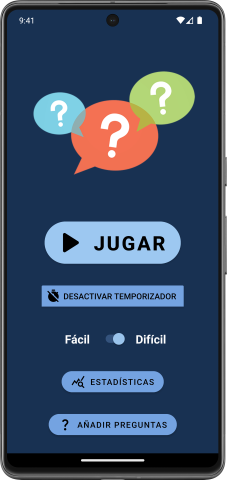
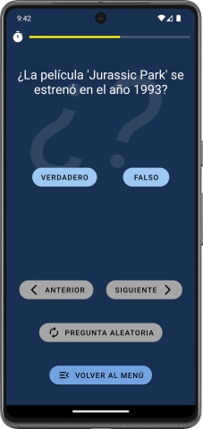
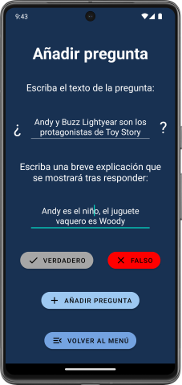

# Questions

Questions is a 'true or false' questions app. It has timer, difficulty, statistics, random questions, possibility to add new questions and local persistence.

It was built in Kotlin using Android Studio.

> [!NOTE]  
This app was developed during my time as a student, under a tight deadline and while managing other projects. It offers the core functionality, but you may encounter bugs, rough edges, and code that’s not production-ready.

# Screenshots

  
  
  
  
  
  
  

